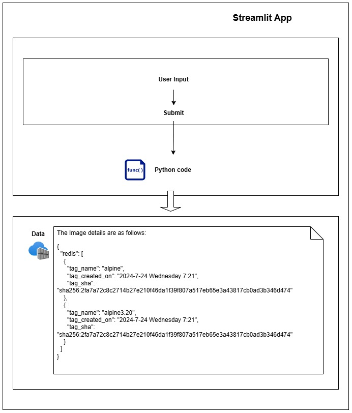
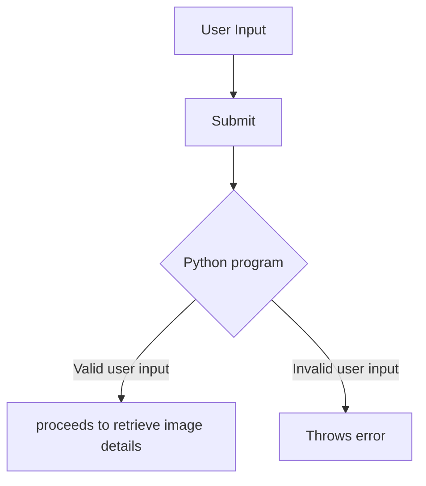
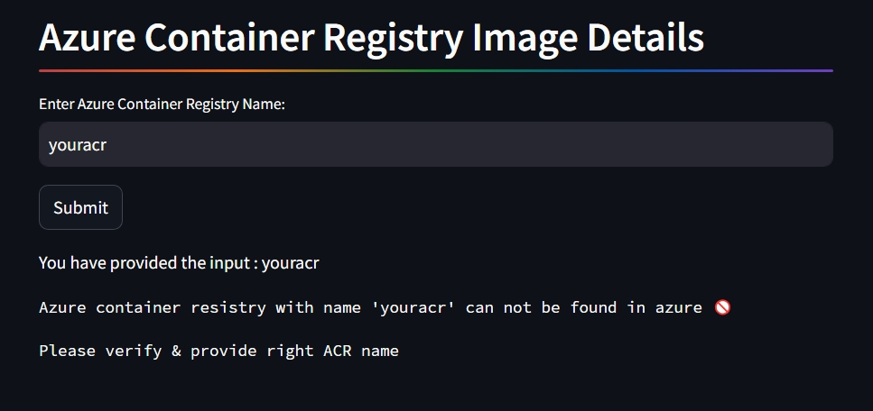

# azure-app-to-get-image-details-from-acr
This app helps in displaying image details available in an azure container registry

# Why the requirement of a application to list azure acr image lists

* Every Cloud platforms will have their own Role based access control system. 

* Sometimes cross collaboration between teams will be happening and they will not be having any access to see resources 
 that belongs to other teams. 

* As an example there is a platform engineering team that maintains docker imagges which are widely used and frequeently built,
    and if teams won't have access to the registry they won't be able to list out the differnt versions of images available.

➦ This application can resolve above mentioned problem.

# What is needed

* The user need to input the name of the Azure container registry he needs to list images from. 

* The Application will get the image names and available tags displayed in the UI.

# Pre requisites

* `azure-identity python sdk` is used for authentiation with azure. Make sure the service principal you are using
 has enough permissions to list images, Acess ACR's. This class `EnvironmentCredential` been used. 
 [azure-identity](https://learn.microsoft.com/en-us/python/api/overview/azure/identity-readme?view=azure-python)

| variable name       | value                                           |
|---------------------|-------------------------------------------------|
| AZURE_CLIENT_ID     | ID of a Microsoft Entra application             |
| AZURE_TENANT_ID     | 	ID of the application's Microsoft Entra tenant |
| AZURE_CLIENT_SECRET |	one of the application's client secrets |

**The above environment variables are required**. [service-principal-with-secret](https://learn.microsoft.com/en-us/python/api/overview/azure/identity-readme?view=azure-python#service-principal-with-secret)

* Microsoft Azure Container Registry Client Library for Python is used to list all images and tags in a ACR.
  [azure-containerregistry](https://learn.microsoft.com/en-us/python/api/overview/azure/containerregistry-readme?view=azure-python)

* Microsoft Azure Resource Graph Client Library [azure-mgmt-resourcegraph](https://learn.microsoft.com/en-us/python/api/azure-mgmt-resourcegraph/azure.mgmt.resourcegraph?view=azure-python)
  used to list the containers to verify and validate the user input container name.

# Architecture diagram

* User access the streamlit app. inputs an acr name

* The user input is passed from streamlit ui to python program as an input.

* Python program lists all containers available in azure using resource graph query and checks if the input is valid

* If the user input which is a acr name is wrong, gets the below error

    

